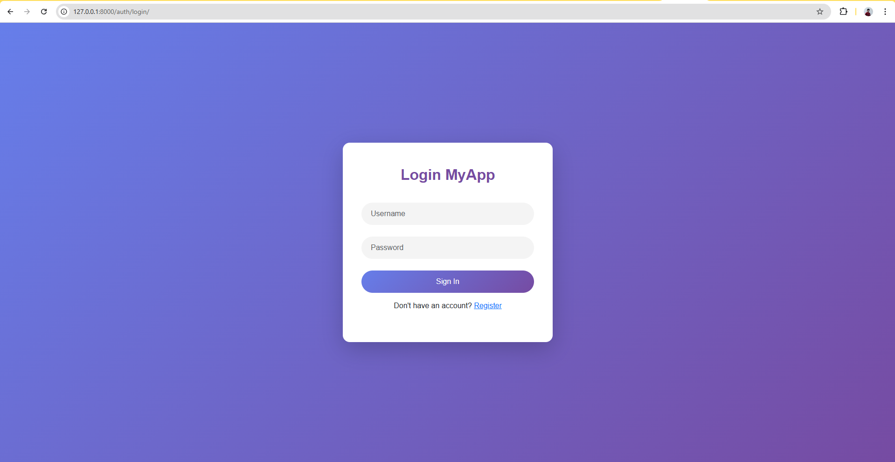
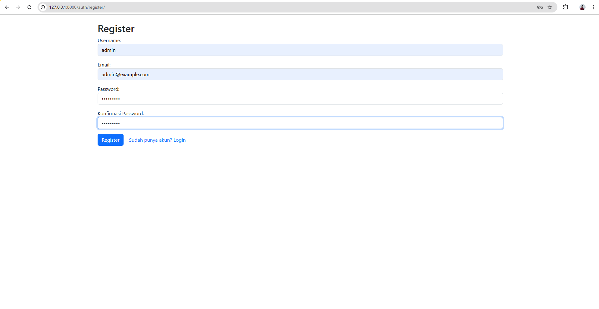
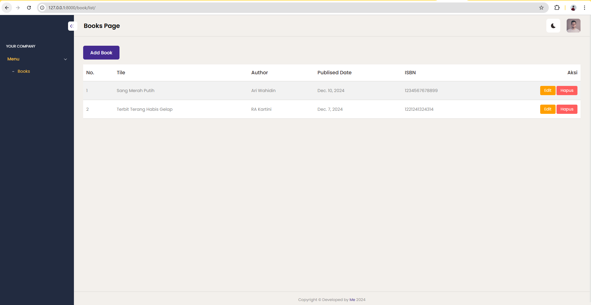
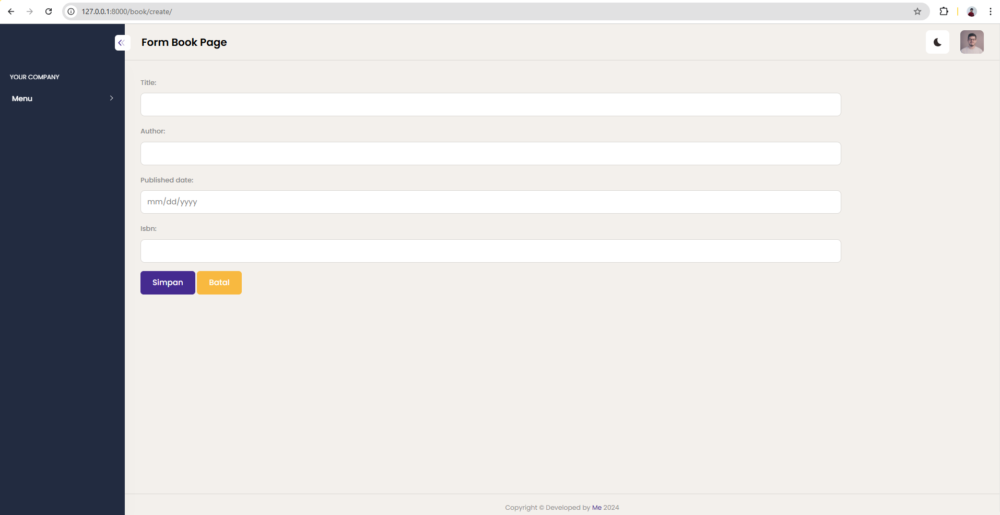
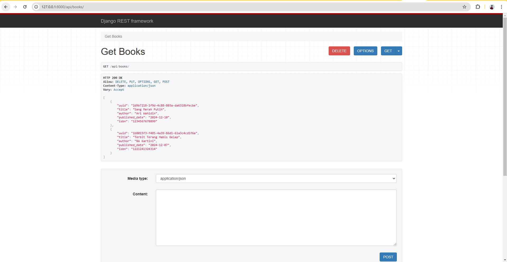

# Simple App With Django

> **My App** adalah aplikasi CRUD sederhana menggunakan bahasa pemrograman Python dengan Framework Django  

---

## 🌟 Fitur Utama

- 🔒 Fitur 1: Login.
- 📊 Fitur 2: Register.
- ✨ Fitur 3: Add Product.
- Fitur 3: API Book

## 📸 Tampilan Aplikasi

Berikut adalah beberapa tampilan dari aplikasi ini:

### Halaman Login

### Halaman Register

### Halaman Book List

### Halaman Book Form

### Halaman Book API

---

## ⚙️ Teknologi yang Digunakan

- **Frontend**: [Bootstrap]
- **Backend**: [Python]
- **Database**: [Postgres]

---

## 🚀 Cara Instalasi

Ikuti langkah-langkah berikut untuk menjalankan aplikasi ini di lingkungan lokal Anda:

1. Clone repositori ini:
   git clone https://github.com/ariwahidin/django-training-challenge.git
2. Buat .env di root project, dan masuk ke mode env
3. Jalankan perintah "pip install -r requirements/dev.txt" untuk update dependency yang dibutuhkan
4. Jalankan perintah "python manage.py runserver" untuk memulai server